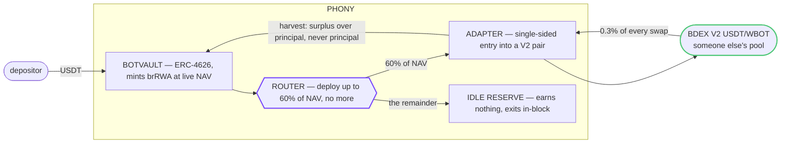

# Phony

**Phony is an ERC-4626 vault that puts a tokenized real-world asset to work and tells the truth
about what it is worth.** A depositor sends one token and receives `brRWA` shares priced off live
NAV. A curator-whitelisted router deploys part of that capital into a real yield venue and holds
the rest idle and instantly withdrawable. Trading fees compound into the share price — nothing to
claim, nothing to stake, no rebasing. Every number on screen is read from the chain at the moment
it is shown, including the ones that are unflattering.

<p>
  <a href="https://phony-rust.vercel.app"><strong>▶ Live site</strong></a>
  &nbsp;·&nbsp; <a href="https://scan.botchain.ai/address/0x6F1C75f7844c6Ffb1b1d676767a8749cfD5CDD21#code"><strong>◆ Mainnet vault — source verified</strong></a>
  &nbsp;·&nbsp; <a href="#proof--the-full-loop-settled-on-chain">Proof</a>
  &nbsp;·&nbsp; <a href="#design-invariants">Invariants</a>
  &nbsp;·&nbsp; <a href="#quickstart">Quickstart</a>
  &nbsp;·&nbsp; MIT · BOT Chain mainnet (chain 677)
</p>

<p>
  
  
  
  
  
  
  
  
  
</p>

---

## Deployments

| network | chain | vault (brRWA) | source |
| --- | ---: | --- | --- |
| **BOT mainnet** | **677** | [`0x6F1C75f7844c6Ffb1b1d676767a8749cfD5CDD21`](https://scan.botchain.ai/address/0x6F1C75f7844c6Ffb1b1d676767a8749cfD5CDD21#code) | verified |
| BOT testnet | 968 | [`0x901e837d0B750b2faC72c6D5a67dfFAcAC14FFab`](https://scan.bohr.life/address/0x901e837d0B750b2faC72c6D5a67dfFAcAC14FFab#code) | verified |

| | mainnet 677 | testnet 968 |
| --- | --- | --- |
| StrategyRouter | [`0xDcB2D4A0…11cE5`](https://scan.botchain.ai/address/0xDcB2D4A08E10850845507B4ddfF95bfFE2411cE5#code) | [`0xa36809be…afc9C`](https://scan.bohr.life/address/0xa36809be4dCB1D8C901F60ab5E5a7A4AcAfafc9C#code) |
| BdexV2LpStrategy | [`0xe0040b6b…c5B3`](https://scan.botchain.ai/address/0xe0040b6bCA2b68eFA75D0243B98AB71843C2c5B3#code) | [`0x24AA76AA…7eee`](https://scan.bohr.life/address/0x24AA76AA2DecdcC38Bd97bBAFdaf44c557B57eee#code) |
| Asset — USDT, 6 dp | [`0xaBabc7Dd…7a3C`](https://scan.botchain.ai/address/0xaBabc7Ddc03e501d190C676BF3d92ef0e6e87a3C) | [`0x75edC933…0fe3`](https://scan.bohr.life/address/0x75edC9335175Fc0552D51D48439F229c10420fe3) |
| Yield venue — BDEX V2 USDT/WBOT | [`0xdc7547f3…b98d`](https://scan.botchain.ai/address/0xdc7547f3cEa82C6Af7fd420656cE532C6da9b98d) | [`0xD3EC2677…94Fa`](https://scan.bohr.life/address/0xD3EC267707BA234583645E75CE283Cf679dd94Fa) |
| Pool depth | 25.97 USDT | 6,568 USDT |
| Strategy cap · vault cap | 2 · 5 USDT | 500 · 1,000 USDT |
| RPC | `https://rpc.botchain.ai` | `https://rpc.bohr.life` |

**Mainnet's caps are two and five USDT, and that is not a typo.** They are ~7.5% of a pool holding
26 USDT, the same discipline testnet applies to a pool holding 6,568. A position that is a large
fraction of its pool pays its own price impact twice and makes NAV a function of its own size
rather than of the market. The vault is sized to the venue that exists rather than the one it would
prefer; raising both is a config change and a redeploy the day the pool is deeper.

Testnet is chain **968** served from `bohr.life`, not a `botchain.ai` subdomain. That asymmetry is
the chain's, and getting it wrong once cost a deployment to a host that does not resolve. Every
endpoint above is from the official
[dev docs](https://dev-docs.botchain.ai/docs/Developers/json-rpc-endpoint/); BDEX addresses from
[its contract list](https://dev-docs.botchain.ai/docs/DEX/contract-addresses/).

## The problem

A tokenized treasury bill, private credit note or commodity receipt sits in a wallet earning one
flat rate, and there is no infrastructure to do anything else with it. ETH has EigenLayer, Lido and
a dozen yield strategies; tokenized real-world assets have none of that. Three specific costs:

1. **Capital inefficiency.** A $10,000 tokenized treasury earns 4% and does nothing else. It cannot
   be collateral, cannot be looped, cannot be composed.
2. **Fragmentation.** Every issuer runs a siloed interface. Comparing yields means several
   dashboards, several wallets and several redemption mechanics.
3. **No auto-compounding.** RWA yields are distributed manually or periodically, and idle cash plus
   reinvestment friction costs roughly 15–20% of effective APY.

## What Phony does



Harvested yield is transferred into the vault while share supply stays fixed. NAV rises, supply
does not, so `convertToAssets` returns more for the same share. Nothing is minted and no balance
rebases, which is what keeps the position composable with anything that reads ERC-4626.

## The constraint — no simulated yield

**BOT Chain has no RWA yield infrastructure.** No tokenized-treasury issuer, no private credit
pool, no lending market, no other ERC-4626 vault — checked against the verified-contract indexes of
both [BOTScan](https://scan.botchain.ai) and [testnet BOTScan](https://scan.bohr.life), and against
the official ecosystem list. The one venue paying real yield on a stablecoin is **BDEX**, the
chain's Uniswap-V2-architecture DEX.

So the vault does one thing for real rather than three things for show:

| | |
| --- | --- |
| **Asset** | The chain's own **USDT** — 287k holders on mainnet. Not a token this repo minted. |
| **Yield** | The **actual trading fees** of a live BDEX V2 pair. Not a rate an admin sets. |
| **Everything else** | The idle reserve, which earns nothing and says so. |

There are **no mock contracts in this repository** — not in `contracts/`, and not behind the tests,
which run against a fork of the live chain. An earlier iteration shipped three strategy legs backed
by mock yield sources and labelled them "demo" in the UI. Deleting them was the better answer than
labelling them. A T-bill leg and a credit leg remain designed for but unbuilt: `IStrategyAdapter`
is unchanged, so each is a config entry and one adapter the day such a venue exists.

## The moat — a vault that reports its own bad news

Any vault can show a number. The distinction is what it does when the honest number is
disappointing, because that is exactly when the incentive to invent one is strongest.

| Situation | The convenient answer | What Phony reports |
| --- | --- | --- |
| Nobody has traded the pool this week | An APY from a mock, a projection, or a rate an admin set | **0.00%** — `estimatedAPY` counts realised yield only |
| Shares are marked above what exiting would realise | Nominal share value in `maxWithdraw`, then a revert at signing | **The real exit quote**, priced through the pool's reserves with the 0.3% fee included |
| The LP position is underwater on impermanent loss | Pay a "yield" out of principal and defer the loss | **Zero yield**, and the loss already in NAV |
| A harvest realises fees | A share-price rise | **A small drop** — the exit fee plus the 10% performance fee, because realising costs something |

That last row cost a test. `harvest()` used to appear to raise the share price, and the rise was
the vault redeploying the proceeds and booking its own entry price impact as a gain. A vault
reporting its own slippage as profit is exactly the failure this table exists to prevent, so the
integration test now bounds the cost instead of asserting a gain.

## Proof — the full loop settled on chain

Run on BOT Chain testnet against vault
[`0x901e837d…14FFab`](https://scan.bohr.life/address/0x901e837d0B750b2faC72c6D5a67dfFAcAC14FFab) —
the same contract source now verified on mainnet.

| step | what happened | tx |
| --- | --- | --- |
| **deposit** | 20 USDT in; 12 routed to the LP leg, 8 held as the reserve | [`0x71ad5e1c…`](https://scan.bohr.life/tx/0x71ad5e1c70531068616667043bf4c707cced3a6744b8c04604481caa832b31c5) |
| **allocate** | single-sided entry into the live pair, real LP minted | same tx, 411,137 gas |
| **harvest** | swept with no fees accrued — reported zero, took no fee | [`0xb04417ea…`](https://scan.bohr.life/tx/0xb04417eae01107fb3db6931e25bd178053663fcac3d05ab024f5caa94439cf43) |
| **withdraw** | 19.9555 USDT returned — the 0.22% round trip through the pool, and nothing else | [`0x5b054851…`](https://scan.bohr.life/tx/0x5b054851029221869d38d8b98606df3816b9cd03f888e8f558a77a2e8aa0c7af) |

### The reserve holds — three consecutive harvests

The keeper calls `harvest()` on a schedule, and that path also redeploys. It is where the reserve
buffer used to quietly disappear.

| # | gas | idle after | tx |
| ---: | ---: | --- | --- |
| 1 | 380,592 | 40.0% | [`0xb04417ea…`](https://scan.bohr.life/tx/0xb04417eae01107fb3db6931e25bd178053663fcac3d05ab024f5caa94439cf43) |
| 2 | 207,258 | 40.0% | [`0xc388b6a7…`](https://scan.bohr.life/tx/0xc388b6a79de80c6fd8f3f10d1f176ba05ccb21ce8094fe98893bd56bd209be03) |
| 3 | 112,591 | 40.0% | [`0x015f3220…`](https://scan.bohr.life/tx/0x015f3220c2d18b69d0257ed0dd745fc5ce1cf79417d75c962bf1ff0f8e993ee0) |

**The falling gas is the fix.** The first call still had a little to place; the second and third
found the vault already at target and placed nothing, so they never touched the pool. Under the old
code all three would have cost roughly the same and each would have taken another 60% of whatever
was left — the reserve reading 40% → 16% → 6.4%.

> Retired: testnet routers `0x624F37AD…D26F3` and `0xfc06f27f…3534B`, plus an earlier pair before
> them. Both were replaced rather than patched in place. **The vault address has never changed**
> across any of it — no share was minted or burned by a migration, so published links, verified
> explorer pages and depositor positions all survived each fix. `rotateStrategy` covers an adapter
> change; `migrateRouter` covers a router change and additionally recalls capital and re-points the
> vault. Each costs one round trip through the pool, printed either side rather than glossed.

## What running against a real pool taught this code

All three were found against live liquidity rather than a mock, and all three are pinned by tests.

**A reserve applied to the wrong denominator is not a reserve.** The router split each *deposit* by
weight — indistinguishable from correct on the first deposit into an empty vault, and wrong on
every call after it, because routing runs again on every deposit *and* every harvest. Each pass
deployed 60% of whatever was still idle, so the buffer decayed as 0.4ⁿ. With the keeper harvesting
every five minutes, the live vault reached 100% deployed while this README, the router's own doc
comment and the whitepaper all claimed 40% was held back. Deployment is now sized against NAV, so
the buffer is a level the vault returns to rather than one it erodes past.

**Swapping half is wrong.** A single-asset vault entering a two-sided pool has to swap part of the
deposit. Swapping exactly half fails: the swap moves the price, so the tokens bought no longer match
the ratio needed to pair the remainder, and `addLiquidity` reverts with `INSUFFICIENT_B_AMOUNT`.
The adapter uses the closed form for a 0.3% pool —
`(sqrt(r·(r·3988009 + a·3988000)) − r·1997) / 1994` — which lands balanced at the *post-swap* price
and leaves only dust.

**Sizing an exit on the spot mark under-delivers.** Burning LP in proportion to spot value yields
slightly less than asked, because proceeds only arrive after the paired half is sold and pays the
fee. On testnet this was an 11-unit shortfall out of 4.4 million — enough for the vault to correctly
reject a withdrawal of its own quoted maximum. The burn is now sized against realisable value.

## Repo layout

| path | what |
| --- | --- |
| [`contracts/contracts/`](./contracts/contracts) | `BotVault` (ERC-4626), `StrategyRouter`, `BaseStrategy`, `BdexV2LpStrategy`, interfaces. |
| [`contracts/test/`](./contracts/test) | 69 tests on a fork of BOT Chain testnet. No mocks, no local stand-ins. |
| [`contracts/scripts/`](./contracts/scripts) | `scanPools` · `inspectPair` · `preflight` · `deploy` · `verify` · `e2e` · `fund` · `exit` · `rotateStrategy` · `migrateRouter` · `harvestBot` · `exportAbi`. |
| [`contracts/deployments/`](./contracts/deployments) | Per-network manifests. The only route addresses take into the frontend. |
| [`web/src/app/`](./web/src/app) | Next.js 16 — landing, `/vault`, `/strategies`, `/portfolio`, `/docs`. |
| [`web/src/lib/`](./web/src/lib) | Chains, wagmi config, generated bindings, formatting. |
| [`web/test/`](./web/test) | 52 tests — wallet, deposit flow, share-price maths, chart states. |

## Quickstart

```bash
# 0. Install
npm --prefix contracts install
npm --prefix web install

# 1. The contracts, against a fork of the live chain — needs network, no keys
npm --prefix contracts run build        # solc 0.8.24, evmVersion paris
npm --prefix contracts test             # 69 tests against real BDEX liquidity

# 2. The app
npm --prefix web test                   # 52 tests, jsdom
npm --prefix web run dev                # http://localhost:3000

# 3. Point at a chain and check before trusting anything
cp contracts/.env.example contracts/.env
npm --prefix contracts run new-deployer      # fresh throwaway key, prints the address
npm --prefix contracts run scan:testnet      # every BDEX pair holding USDT, by depth
npm --prefix contracts run preflight:testnet # read-only. Sends nothing.

# 4. Deploy
npm --prefix contracts run deploy:testnet
npm --prefix contracts run verify:testnet
npm --prefix contracts run export-abi        # addresses + ABIs into web/
npm --prefix contracts run e2e:testnet       # full loop against real BDEX
npm --prefix contracts run harvest-bot       # keeper, leave running
```

`preflight` earns its place: every check it makes otherwise costs a failed deploy to discover — an
RPC that does not resolve, a chain id disagreeing with the config, an unfunded deployer, a pair that
does not exist, a pool too thin to enter. It caught a stale `ASSET_DECIMALS=18` that would have made
every amount wrong by 10¹², and it blocked the first mainnet deploy over a testnet-sized cap.

`scan` and `inspect` answer what preflight cannot, because preflight only checks the leg already in
the config: *is this the right pool at all?* Between them they chose the mainnet caps and rejected
the chain's deepest USDT pool — see [Sizing against the pool that exists](#sizing-against-the-pool-that-exists).

### Trying it yourself

Point a wallet at chain **968** (`https://rpc.bohr.life`). Two things are needed and only one has a
faucet:

| | |
| --- | --- |
| **Gas** | [faucet.botchain.ai/basic](https://faucet.botchain.ai/basic) — 10 tBOT per 24h. |
| **The asset** | No faucet, because it is the chain's real USDT. Swap BOT for it through BDEX. |

That friction is the honest kind — a vault that could mint its own deposit token would not be
accepting a real asset. `RECIPIENT=0x… npm --prefix contracts run fund:testnet` shortcuts it for
anyone holding the deployer key, sending gas and USDT and buying the USDT on BDEX if short.

Two expectations before you look: **APY reads 0.00%** unless somebody has recently traded the pair,
and **`Exitable this block` sits below TVL** by what unwinding would cost. Both are the design
working, not bugs.

## Sizing against the pool that exists

`npm run scan:mainnet` walks all 27 BDEX V2 pairs and reports how much USDT each holds. The result
chose the caps:

| pair | USDT depth | usable |
| --- | ---: | --- |
| USDT/Money | 470,741 | **no** — see below |
| USDT/WBOT | 25.97 | yes |
| USDT/COW | 16.07 | too thin to bother |
| everything else | < 9 | " |

**The one deep pool on the chain is unusable.** `Money` ([`0xdaaABBD1…a5e2`](https://scan.botchain.ai/address/0xdaaABBD103c95395197c79890858922549a7a5e2), verified as `MToken`) is
fee-on-transfer — 2% on buys, 10% on sells — with an owner-settable `isBlacklisted` mapping that
exempts only the pair, a `tradingEnabled` kill switch and a 10-second sell cooldown. The adapter
would enter 2% short of the router's quote, and far worse, `_sourceLiquidity` prices exits with the
pool's 0.3% fee and would therefore over-quote every exit by the missing 10% — `maxWithdraw` would
promise an exit the chain refuses, the exact failure this design exists to prevent. The adapter
reverting rather than transacting there is the correct outcome; it is not built for such tokens and
does not pretend to be.

That leaves USDT/WBOT. WBOT itself is clean — a WETH9-style wrapper with no owner, no tax, no hooks.

## Design invariants

- **NAV is a measurement, never a stored number.** `totalAssets()` queries every adapter on every
  call and the adapter reads the pair's live reserves. A drop in WBOT moves the share price in the
  same block; impermanent loss is not deferred to a rebase.
- **`maxWithdraw` quotes the exit the way the exit will execute.** `_sourceAssets` marks the LP at
  spot, the honest mark-to-market. `_sourceLiquidity` prices the exit as constant-product output
  against the reserves left after the burn, fee included. The vault's maximum is built on the
  second, so it never offers an exit the chain would refuse.
- **The curator cannot take the money.** Every `onlyOwner` path moves capital between the vault and
  a whitelisted adapter, or back. There is no route from an admin function to an arbitrary
  transfer, and the vault asset is excluded from the rescue function.
- **Harvest can never pay principal out as yield.** `BaseStrategy` enforces
  `yield = totalAssets() − totalDeposited` and frees exactly that difference. A position underwater
  reports zero, not a loss dressed as a distribution.
- **The reserve is a fraction of NAV, not of the last deposit.** Repeated routing converges on the
  buffer instead of eroding it, which is what makes it safe for a keeper to run on a schedule.
- **Position caps are scoped per network with no shared fallback.** `MAINNET_LEG_CAP` and
  `TESTNET_LEG_CAP` are separate names because the two pools differ 250×, and a single variable
  reads as a convenience while behaving as a trap.
- **The pair is the one the factory registered.** A look-alike pair would be reserves an attacker
  controls, and every value the adapter reports derives from those reserves.
- **No mocks anywhere**, including under the tests. A swap in a test is a swap through the same
  router production uses, priced by the same reserves, paying the same 0.3%.

## Security posture

| risk | mitigation |
| --- | --- |
| Reentrancy | `ReentrancyGuard` on every external entrypoint across vault, router and adapter |
| Overflow | Solidity 0.8 checked arithmetic |
| Pair spoofing | Adapter verifies the pair against the DEX **factory** for the two tokens |
| Swap sandwiching | Entry and exit both carry a slippage bound — 100 bps default, 1000 bps ceiling — and revert rather than accept worse |
| Impermanent loss | Marked live into NAV rather than deferred; `harvest` reports zero while underwater |
| Price impact | Per-strategy caps sized against pool depth, plus a vault-level deposit cap |
| Strategy failure | Per-adapter emergency exit unwinds LP to plain asset without changing NAV or blocking withdrawals — exercised on chain |
| Centralisation | No admin path to an arbitrary transfer; fee capped at 20% and charged on yield only |
| Oracle manipulation | No external price oracles; the asset side of the pair *is* the unit of account |
| Illiquid exits | `maxWithdraw` reports the real exit quote, fee included, not nominal share value |
| Post-Shanghai opcodes | `evmVersion` pinned to `paris`, so no PUSH0 reaches BOT Chain bytecode |

## Live deployment

The app defaults to **mainnet (677)**, set as a code fallback in `src/lib/chains.ts` rather than as
a required environment variable — a hosted build with no environment set would otherwise point at
testnet while this file advertises mainnet addresses. Connecting a wallet to either chain works;
every read is keyed on the connected chain, and a chain with no deployment renders as unconfigured
rather than guessing an address.

| Vercel setting | value |
| --- | --- |
| Root Directory | `web` |
| Framework | Next.js (auto-detected) |
| `NEXT_PUBLIC_DEFAULT_CHAIN_ID` | optional — `968` to target testnet |
| `NEXT_PUBLIC_WALLETCONNECT_PROJECT_ID` | optional — only adds the WalletConnect QR flow |

Addresses reach the app only through `contracts.generated.ts`, which is committed, so the frontend
builds on a clean clone with no contract build step. After redeploying contracts, run
`export-abi` and commit the result. Explorer links resolve per chain, so every proof link on every
page follows the connected network without a code change.

## Testing

```bash
npm --prefix contracts test    # 69 tests, fork of BOT Chain testnet
npm --prefix web test          # 52 tests, vitest + jsdom
npm --prefix web run typecheck
npm --prefix web run build
```

The chain suite forks testnet, so it exercises things a mock cannot produce: `generateTradingFees`
round-trips real volume so each swap pays 0.3% into the reserves; `crashPairedToken` dumps WBOT so
the price genuinely falls, where the old mock had a `setLpValueBps` setter; test USDT comes from
impersonating a large holder because there is no mint function.

| suite | covers |
| --- | --- |
| `BotVault` | ERC-4626 conformance, weighted routing, the reserve holding across repeated deployment, liquidity-aware maxima, harvest and fees, pause, curator controls, multi-user share accounting |
| `StrategyRouter` | whitelisting, weight ceilings, wrong-asset rejection, caps, proportional withdrawal across two venues, retirement, rebalancing, packed views |
| `Integration` | the full loop, NAV conservation at every step, a real drawdown, the curator-cannot-drain sequence, emergency exit |
| `Smoke` | the fork itself, the exit-quote regression, fee accrual, the realised-APY rule |

The router tests need two strategies to mean anything and there is no mock adapter, so the second
leg is **another live pair** (USDT/USDT4). One consequence is worth stating: a rebalance moves
capital through two real pools and pays their fees, so NAV falls slightly every time. A mock would
have shown that as free.

The frontend suite stubs the write path on purpose. Whether the chain *accepts* a call is settled
in `contracts/test` against a fork of the real BDEX, which is the only place that answer means
anything. What the UI suite pins is the decision made before a signature is requested.

## Research basis

| reference | what it contributed |
| --- | --- |
| [stakekit/yield.xyz](https://github.com/stakekit/yield.xyz) | Unified yield aggregation across 70+ networks proves aggregation needs one standardised interface per source. `IStrategyAdapter` is that interface. |
| [dittonetwork/curator-vault](https://github.com/dittonetwork/curator-vault) | The curator pattern reduced to its safe core — whitelist, weight, retire, nothing else. |
| [OpenZeppelin](https://github.com/OpenZeppelin/openzeppelin-contracts) | Battle-tested ERC-4626, Ownable, Pausable, ReentrancyGuard, inherited directly. |
| [Uniswap V2](https://github.com/Uniswap/v2-core) | BDEX is a V2 deployment. Its constant-product and optimal one-sided-supply arithmetic is reproduced in the adapter, verified wei-exact against BDEX's own router. |
| [aboudjem/ERC-3643](https://github.com/aboudjem/ERC-3643) | T-REX informed keeping the adapter interface narrow enough that a future `ERC3643Adapter` could enforce compliance before deposit without touching the vault. |
| [VaultWatch](https://github.com/VaultWatch) | Keeper orchestration: batch strategies into one transaction, emit events for auditability, gate execution on yield clearing a multiple of gas cost. |

Frontend design system derived from [mystiquemide/kyvrane](https://github.com/mystiquemide/kyvrane) (MIT).

## Status

Pre-audit. Deployed to BOT Chain mainnet with verified source, and not through external review. The
mainnet vault is capped at 5 USDT because the venue behind it is a pool holding 26. Use amounts you
are willing to lose.

## Licence

[MIT](./LICENSE). Built on BOT Chain for the BOT Chain Builder Challenge — not an official BOT Chain
product and not affiliated with BOT Chain.
